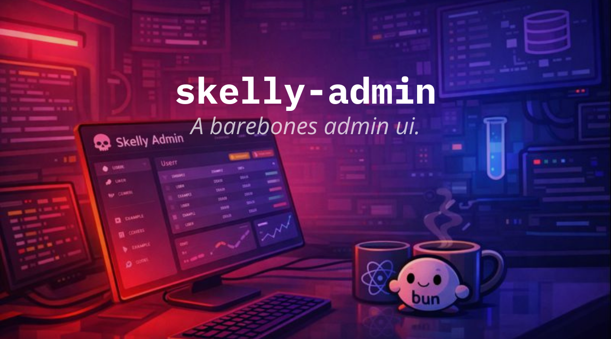

# Skelly Admin

> A clean, typed, no-nonsense admin frontend for product-first builders.

Skelly Admin exists to answer a different question than the backend:

**“Can I see and control my product without fighting my frontend?”**

If yes, good. That’s the job.

---

## What This Is

Skelly Admin is a **Vite + React admin application** designed to pair cleanly with Skelly Backend.

It is built for:

* Internal admin tools
* Operator dashboards
* Early product control panels
* Typed, end-to-end workflows

It assumes:

* You control the backend
* You value clarity over polish
* You want types to flow, not drift

---

## What This Is (and Can Become)

Right now (v0), Skelly Admin is:

* A Vite + React app
* Typed end-to-end with tRPC
* Styled with Tailwind + shadcn/ui
* Theme-aware (light/dark)

It is meant to be:

* Forked
* Hacked
* Extended
* Re-skinned

If you want to:

* Add auth
* Replace the UI kit
* Introduce routing
* Split roles and permissions
* Turn this into a full dashboard

Do it.

This repo is a starting point, not a finished product.

---

## Tech Stack

* **Framework:** React (Vite)
* **Styling:** Tailwind CSS + shadcn/ui
* **Data:** tRPC + TanStack Query
* **Theming:** next-themes
* **Runtime:** Browser

No Next.js. No server components. No magic.

---

## Project Structure

```
skelly-admin/
├─ src/
│  ├─ components/
│  │  ├─ ui/                # shadcn components
│  │  ├─ mode-toggle.tsx    # theme switcher
│  │  └─ theme-provider.tsx
│  ├─ lib/
│  │  └─ trpc.ts            # typed tRPC client
│  ├─ App.tsx               # app entry UI
│  ├─ main.tsx              # providers + bootstrap
│  └─ index.css
├─ public/
├─ package.json
├─ vite.config.ts
└─ README.md
```

---

## How It Connects to the Backend

Skelly Admin talks to Skelly Backend via **tRPC**.

Types flow from the backend router:

```
AppRouter -> @trpc/react-query -> UI
```

If the backend changes, the frontend knows.
If types break, the build breaks.

This is intentional.

---

## Local Development

Make sure the backend is running first.

Then:

```bash
npm install
npm run dev
```

Admin app:

```
http://localhost:5173
```

Backend expected at:

```
http://localhost:3001/trpc
```

---

## Health Check

The default UI performs a simple health check:

```
health.check
```

If you see data rendered on screen, the pipe is connected.

If not, fix the backend first.

---

## Styling and UI

This project uses:

* Tailwind for layout and spacing
* shadcn/ui for primitives
* Minimal global CSS

The goal is:

* Fast iteration
* Predictable components
* Easy replacement

Design systems should serve the product, not the other way around.

---

## Philosophy (Short Version)

* UI is a tool, not a trophy
* Types are part of the UX
* Internal tools deserve clarity
* Delete components aggressively

Skelly Admin is intentionally boring.
Boring scales.

---

## When to Outgrow This

You will know it’s time when:

* Routing becomes complex
* Permissions need structure
* Multiple operators exist
* The UI stops fitting on one screen

Until then, this is enough.

---

## Final Note ☠️

If this admin feels almost too simple,
that’s correct.

Build the product first.
Polish later.
